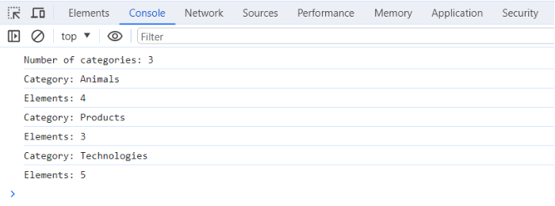

# Домашнє завдання №7 `goit-js-hw-07`

> [!NONES] Для стилізації розмітки твоїх завдань використовуй цей
> [макет](https://www.figma.com/file/m8k9NQV7qZrtYDCvxfD68B/%D0%94%D0%97-JavaScript?type=design&node-id=0-1&mode=design&t=hVhPAcFeZ24V6Z6V-0).

## Завдання 1

HTML містить список категорій `ul#categories`.

```html
<ul id="categories">
  <li class="item">
    <h2>Animals</h2>
    <ul>
      <li>Cat</li>
      <li>Hamster</li>
      <li>Horse</li>
      <li>Parrot</li>
    </ul>
  </li>
  <li class="item">
    <h2>Products</h2>
    <ul>
      <li>Bread</li>
      <li>Parsley</li>
      <li>Cheese</li>
    </ul>
  </li>
  <li class="item">
    <h2>Technologies</h2>
    <ul>
      <li>HTML</li>
      <li>CSS</li>
      <li>JavaScript</li>
      <li>React</li>
      <li>Node.js</li>
    </ul>
  </li>
</ul>
```

З використанням властивостей і методів `DOM`-елементів, напиши скрипт, який:

1. Порахує й виведе в консоль кількість категорій в `ul#categories`, тобто
   елементів `li.item`.
2. Для кожного елемента `li.item` у списку `ul#categories` знайде й виведе в
   консоль текст заголовка елемента (тегу `<h2>`) і кількість елементів у
   категорії (усіх `<li>`, вкладених у нього).

#### На що буде звертати увагу ментор при перевірці:

- Кількість категорій, їх назва та кількість елементів отримані за допомогою
  властивостей і методів `DOM`-елементів
- Дані за кожною категорією були отримані й виведені в консоль у тілі циклу або
  методу `forEach()`
- У консолі має бути виведено наступне повідомлення:



## Завдання 2

Напиши скрипт для створення галереї зображень на основі масиву даних. `HTML`
містить список `ul.gallery`.

```html
<ul class="gallery"></ul>
```

Використовуй масив об'єктів images для створення елементів ``, вкладених в
`<li>`.

Ти можеш створити й додати `HTML`-елементи, використовуючи
`document.createElement()` і `elem.append()` або шаблонні рядки і
`elem.insertAdjacentHTML()`.

- Усі елементи галереї повинні додаватися в `DOM` за одну операцію додавання.
- Додай мінімальне оформлення галереї флексбоксами через `CSS` класи.

```js
const images = [
  {
    url: 'https://images.pexels.com/photos/140134/pexels-photo-140134.jpeg?auto=compress&cs=tinysrgb&dpr=2&h=750&w=1260',
    alt: 'White and Black Long Fur Cat',
  },
  {
    url: 'https://images.pexels.com/photos/213399/pexels-photo-213399.jpeg?auto=compress&cs=tinysrgb&dpr=2&h=750&w=1260',
    alt: 'Orange and White Koi Fish Near Yellow Koi Fish',
  },
  {
    url: 'https://images.pexels.com/photos/219943/pexels-photo-219943.jpeg?auto=compress&cs=tinysrgb&dpr=2&h=750&w=1260',
    alt: 'Group of Horses Running',
  },
  {
    url: 'https://images.pexels.com/photos/66898/elephant-cub-tsavo-kenya-66898.jpeg?auto=compress&cs=tinysrgb&w=1260&h=750&dpr=2',
    alt: 'Elephant Beside on Baby Elephant',
  },
  {
    url: 'https://images.pexels.com/photos/37833/rainbow-lorikeet-parrots-australia-rainbow-37833.jpeg?auto=compress&cs=tinysrgb&w=1260&h=750&dpr=2',
    alt: 'Blue Geeen and Orange Parrot',
  },
  {
    url: 'https://images.pexels.com/photos/247376/pexels-photo-247376.jpeg?auto=compress&cs=tinysrgb&w=1260&h=750&dpr=2',
    alt: 'Zebras on Zebra',
  },
];
```

#### На що буде звертати увагу ментор при перевірці:

- Створена й додана в `DOM` галерея із шести зображень
- Галерея додана у список `ul.gallery` і являє собою 6 елементів `<li>`, в які
  вкладені елементи ``
- Для створення елементів `` використані дані з масиву об’єктів `images`
- Усі елементи галереї додані в `DOM` за одну операцію додавання
- Є мінімальне оформлення галереї флексбоксами через `CSS` класи

## Завдання 3

Напиши скрипт, який під час набору тексту в інпуті `input#name-input` (подія
`input`) підставляє його поточне значення в `span#name-output` як ім’я для
привітання. Обов’язково очищай значення в інпуті по краях від пробілів . Якщо
інпут порожній або містить лише пробіли, то замість імені у спан має
підставлятися рядок `"Anonymous"`.

```html
<input type="text" id="name-input" placeholder="Please enter your name" />
<h1>Hello, <span id="name-output">Anonymous</span>!</h1>
```

#### На що буде звертати увагу ментор при перевірці:

- На елементі `input#name-input` прослуховується подія `input`
- Під час набору тексту в інпуті його поточне значення підставляється в
  `span#name-output` як ім’я для привітання
- Значення в інпуті очищене від пробілів по краях
- Якщо інпут порожній або містить лише пробіли, то замість імені у спан має
  підставлятися рядок `"Anonymous"`

## Завдання 4

Напиши скрипт управління формою логіна.

```html
<form class="login-form">
  <label>
    Email
    <input type="email" name="email" />
  </label>
  <label>
    Password
    <input type="password" name="password" />
  </label>
  <button type="submit">Log in</button>
</form>
```

1. Обробка відправлення форми `form.login-form` повинна відбуватися за подією
   `submit`.
2. Під час відправлення форми сторінка не повинна перезавантажуватися.
3. Якщо при сабміті у формі є незаповнені поля, виводь `alert` з попередженням
   про те, що `'All form fields must be filled in'`. Не додавай на інпути
   атрибут `required`, валідація має відбуватися саме через `JS`.
4. Якщо користувач заповнив усі поля і відправив форму, збери значення полів в
   об'єкт з двома властивостями, де ключ — це ім'я інпутів, а значення —
   відповідні значення цих інпутів, очищені від пробілів по краях. Для доступу
   до елементів форми використовуй властивість `elements`.
5. При сабміті форми виведи об'єкт із введеними даними в консоль і очисти
   значення полів форми методом `reset`.

На що буде звертати увагу ментор при перевірці:

- Прослуховується подія `submit`
- Під час відправлення форми сторінка не перезавантажується
- Якщо при сабміті у формі є незаповнені поля, виводиться `alert`
- При сабміті в консоль виводиться об’єкт з двома властивостями, де ключі — це
  ім’я інпутів, а значення — відповідні значення цих інпутів, очищені від
  пробілів по краях
- Після сабміту елементи форми очищаються

## Завдання 5

Напиши скрипт, який змінює колір фону елемента `<body>` через інлайн-стиль по
кліку на `button.change-color` і задає це значення кольору текстовим вмістом для
`span.color`.

```html
<div class="widget">
  <p>Background color: <span class="color">-</span></p>
  <button type="button" class="change-color">Change color</button>
</div>
```

Для генерування випадкового кольору використовуй функцію `getRandomHexColor()`.

```js
function getRandomHexColor() {
  return `#${Math.floor(Math.random() * 16777215)
    .toString(16)
    .padStart(6, 0)}`;
}
```

Зверни увагу, що функція `getRandomHexColor()` повертає колір у `hex`-форматі, в
той час як колір фону на `<body>` буде у форматі `rgb`. Це нормально й не
потребує якихось правок.

#### На що буде звертати увагу ментор при перевірці:

- Фон на `<body>` задається тільки після кліку на `button.change-color`
- При кожному кліку на елемент `button.change-color` фон `<body>` зафарбовується
  новим рандомним кольором
- На `<body>` і `span.color` значення одного й того самого кольору

## Завдання 6

Напиши скрипт створення й очищення колекції елементів з наступним функціоналом.

Є `input`, у який користувач вводить бажану кількість елементів. Після
натискання на кнопку `Create` має рендеритися (додаватися в `DOM`) колекція з
відповідною кількістю елементів і очищатися значення в інпуті. При повторному
натисканні на кнопку `Create` поверх старої колекції має рендеритись нова. Після
натискання на кнопку `Destroy` колекція елементів має очищатися.

```html
<div id="controls">
  <input type="number" min="1" max="100" step="1" />
  <button type="button" data-create>Create</button>
  <button type="button" data-destroy>Destroy</button>
</div>

<div id="boxes"></div>
```

Після натискання користувачем на кнопку `Create` треба провалідувати значення в
`input`, воно має бути в межах від `1` до `100` включно. Тільки якщо воно
задоволяє умову, мають додаватися нові `<div>` елементи в `DOM`.

Для рендеру елементів на сторінці створи функцію `createBoxes(amount)`, яка
приймає один параметр — число, що зберігає кількість елементів для рендеру.
Функція має створювати стільки `<div>` елементів, скільки вказано в параметрі
`amount` і додавати їх у `DOM` дочірніми елементами для `div#boxes`.

1. Розміри першого `<div>` елемента мають бути `30px` на `30px`.
2. Кожен наступний елемент повинен бути ширшим і вищим від попереднього на
   `10px`.
3. Усі елементи повинні мати випадковий колір фону. Використовуй готову функцію
   `getRandomHexColor()` для отримання випадкового кольору.

```js
function getRandomHexColor() {
  return `#${Math.floor(Math.random() * 16777215)
    .toString(16)
    .padStart(6, 0)}`;
}
```

Для очищення колекції після натискання на кнопку `Destroy` створи функцію
`destroyBoxes()`, яка очищає вміст `div#boxes`, у такий спосіб видаляючи всі
створені елементи.

#### На що буде звертати увагу ментор при перевірці:

- Після кліку на кнопку `Create`, якщо в `input` значення поза межами діапазо
- Після кліку на кнопку `Create` в `div#boxes` додається така кількість
  різнокольорових квадратів, яка вказана в `input`. Значення `input` очищається
- Після повторного кліку на кнопку `Create` попередні квадрати повністю
  прибираються і замість них додаються нові у кількості, що вказана в `input`.
  Значення `input` очищається
- Усі квадрати в `div#boxes` різнокольорові і мають фон випадкового кольору
- Перший квадрат у `div#boxes` має розміри `30px` на `30px`, а кожен наступний
  на `10px` вищий і ширший від попереднього
- Після натискання на кнопку `Destroy` усі квадрати з `div#boxes` мають
  видалятися
